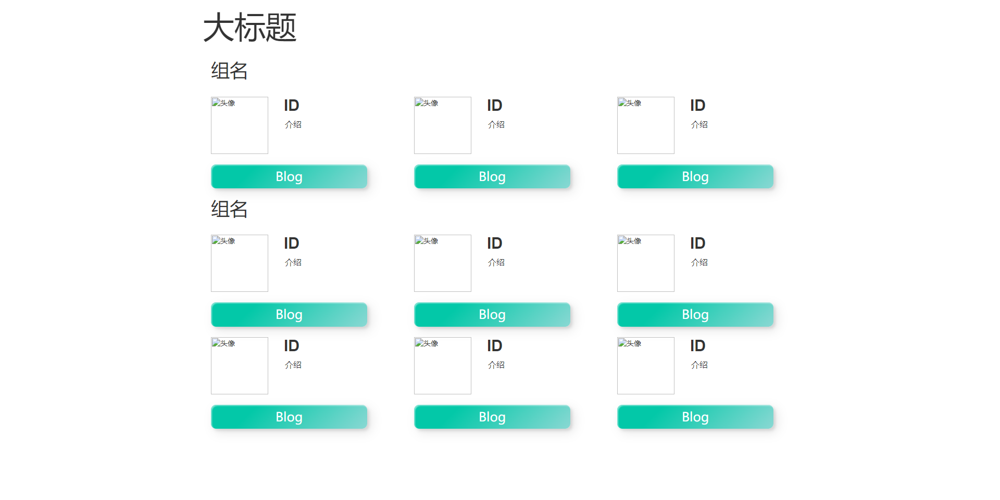
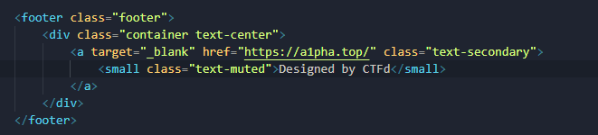
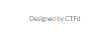
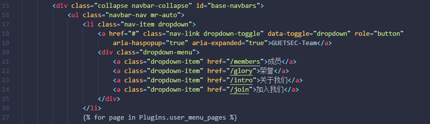
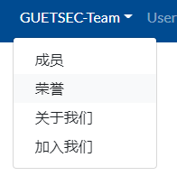
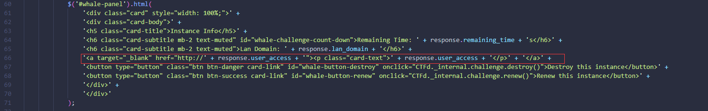
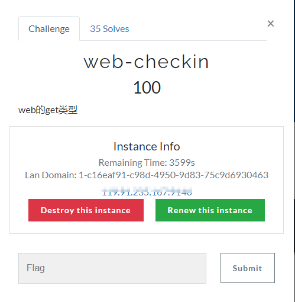

# 平台前端页面框架

> 2022-8-18第一版

## 主页

```html
<div class="row">
    <div class="col-md-6 offset-md-3">
        
        <h3 class="text-center">
            <p> text <a href="url">text</a></p>
        </h3>
        <p style="text-align: center;">QQ群名<a target="_blank"
                href="QQ群链接">  QQ群号 </a></p>
        <p style="text-align: center;">友情链接：<a href="url" target="_blank">text</a></p>
    </div>
</div>
```

## 成员

```html
<style>
    /*让头像变圆*/
    .round_icon {
        width: 110px;
        height: 110px;
        display: flex;
        border-radius: 50%;
        align-items: center;
        justify-content: center;
        overflow: hidden;
    }
	/*一级标题设置*/
    h1 {
        font-family: Raleway, RalewayOffline, sans-serif;
        font-weight: 500;
        letter-spacing: 2px
    }
	/*每个头像的大小设置*/
    .article {
        padding: 10px;
        background: white;
        width: 0 auto;
    }
	/*每个分组的设置*/
    .section {
        display: flex;
        flex-direction: row;
    }
</style>
<h1 style="color: black;text-align: center; ">标题</h1>
<p style="color: black;text-align:center;">(点击头像可前往各位师傅们的博客)</p>
<h1 style="color: black;text-align: left; ">分组组名</h1>
<div class="section">
    <div class="article">
        <a href="博客地址" target="_blank">
            </a>
        <h2 style="font-size: 20px;"> 师傅id </h2>
        <p>师傅简介</p>
    </div>
</div>
```

## 简介

```html
<style>
    /*设置文本首行缩进2个字符*/
    p {
        text-indent: 2em;
    }
</style>
<h1 style="color: black;text-align:left;">标题</h1>
<p>text</p>
```

> 2022-8-24第二版
>
> 这一次是根据bootstrap框架来写

## 成员

- 成品



- 代码：

```html
<!DOCTYPE html>
<html>

<head>
  <title>框架</title>
  <meta charset="utf-8">
  <meta name="viewport" content="width=device-width, initial-scale=1">
  <link rel="stylesheet" href="https://cdn.staticfile.org/twitter-bootstrap/3.3.7/css/bootstrap.min.css">

  <script src="https://cdn.staticfile.org/jquery/2.1.1/jquery.min.js"></script>
  <script src="https://cdn.staticfile.org/twitter-bootstrap/3.3.7/js/bootstrap.min.js"></script>

  <style>
    .btn {
      width: 300px;
      height: auto;
      background: linear-gradient(315deg, #89d8d3 0%, #03c8a8 74%);
      border: none;
      border-radius: 10px;
      font-family: 'Lato', sans-serif;
      font-weight: 500;
      font-size: 24px;
      color: #fff;
      box-shadow: inset 2px 2px 2px 0px rgba(255, 255, 255, .5), 7px 7px 20px 0px rgba(0, 0, 0, .1), 4px 4px 5px 0px rgba(0, 0, 0, .1);
      outline: none;
      position: relative;
      z-index: 0;
    }

    .btn::before {
      position: absolute;
      content: '';
      left: 0;
      bottom: 0;
      width: 100%;
      height: 0;
      transition: all 0.3s ease;
      border-radius: 10px;
      background: linear-gradient(315deg, #4dccc6 0%, #96e4df 74%);
      z-index: -1;
    }

    .btn:hover::before {
      top: 0;
      height: 100%;
    }

    .btn:active {
      top: 2px;
    }

    .top-buffer {
      margin-top: 20px;
    }
  </style>
</head>

<body>
  <div class="container">
    <div class="row">
      <div class="col-lg-12">
        <h1 style="font-size: 60px;">大标题</h1>
      </div>
    </div>
    <div class="container">
      <div class="row">
        <div class="col-xs-12">
          <h1>组名</h1>
        </div>
        <div class="col-lg-4">
          <div class="col-lg-12">&nbsp;</div> 
          <h2 style="text-indent: 1em; font-weight: bold;">ID</h2>
          <p style="text-indent: 2em; font-size:medium;">介绍</p>
          <div class="col-lg-12">&nbsp;</div>
          <div class="col-col-lg-4">
            <a href="" target="_blank" class="btn">Blog</a>
          </div>
        </div>
        <div class="col-lg-4">
          <div class="col-lg-12">&nbsp;</div> 
          <h2 style="text-indent: 1em; font-weight: bold;">ID</h2>
          <p style="text-indent: 2em; font-size:medium;">介绍</p>
          <div class="col-lg-12">&nbsp;</div>
          <div class="col-col-lg-4">
            <a href="" target="_blank" class="btn">Blog</a>
          </div>
        </div>
        <div class="col-lg-4">
          <div class="col-lg-12">&nbsp;</div> 
          <h2 style="text-indent: 1em; font-weight: bold;">ID</h2>
          <p style="text-indent: 2em; font-size:medium;">介绍</p>
          <div class="col-lg-12">&nbsp;</div>
          <div class="col-col-lg-4">
            <a href="" target="_blank" class="btn">Blog</a>
          </div>
        </div>
      </div>
      <div class="row">
        <div class="col-xs-12">
          <h1>组名</h1>
        </div>
        <div class="col-lg-4">
          <div class="col-lg-12">&nbsp;</div> 
          <h2 style="text-indent: 1em; font-weight: bold;">ID</h2>
          <p style="text-indent: 2em; font-size:medium;">介绍</p>
          <div class="col-lg-12">&nbsp;</div>
          <div class="col-col-lg-4">
            <a href="" target="_blank" class="btn">Blog</a>
          </div>
        </div>
        <div class="col-lg-4">
          <div class="col-lg-12">&nbsp;</div> 
          <h2 style="text-indent: 1em; font-weight: bold;">ID</h2>
          <p style="text-indent: 2em; font-size:medium;">介绍</p>
          <div class="col-lg-12">&nbsp;</div>
          <div class="col-col-lg-4">
            <a href="" target="_blank" class="btn">Blog</a>
          </div>
        </div>
        <div class="col-lg-4">
          <div class="col-lg-12">&nbsp;</div> 
          <h2 style="text-indent: 1em; font-weight: bold;">ID</h2>
          <p style="text-indent: 2em; font-size:medium;">介绍</p>
          <div class="col-lg-12">&nbsp;</div>
          <div class="col-col-lg-4">
            <a href="" target="_blank" class="btn">Blog</a>
          </div>
        </div>
        <div class="col-lg-4">
          <div class="col-lg-12">&nbsp;</div> 
          <h2 style="text-indent: 1em; font-weight: bold;">ID</h2>
          <p style="text-indent: 2em; font-size:medium;">介绍</p>
          <div class="col-lg-12">&nbsp;</div>
          <div class="col-col-lg-4">
            <a href="" target="_blank" class="btn">Blog</a>
          </div>
        </div>
        <div class="col-lg-4">
          <div class="col-lg-12">&nbsp;</div> 
          <h2 style="text-indent: 1em; font-weight: bold;">ID</h2>
          <p style="text-indent: 2em; font-size:medium;">介绍</p>
          <div class="col-lg-12">&nbsp;</div>
          <div class="col-col-lg-4">
            <a href="" target="_blank" class="btn">Blog</a>
          </div>
        </div>
        <div class="col-lg-4">
          <div class="col-lg-12">&nbsp;</div> 
          <h2 style="text-indent: 1em; font-weight: bold;">ID</h2>
          <p style="text-indent: 2em; font-size:medium;">介绍</p>
          <div class="col-lg-12">&nbsp;</div>
          <div class="col-col-lg-4">
            <a href="" target="_blank" class="btn">Blog</a>
          </div>
        </div>
      </div>
    </div>
  </div>
</body>

</html>
```

# 平台的其他优化

## 脚标

- 文件位置
  `/root/CTFd/CTFd/themes/core/templates/base.html`

- 源码：



- 效果

  

## 收缩导航栏

- 文件位置

  `/root/CTFd/CTFd/themes/core/templates/components/navbar.html`

- 源码：

```html
<li class="nav-item dropdown">
                    <a href="#" class="nav-link dropdown-toggle" data-toggle="dropdown" role="button"
                        aria-haspopup="true" aria-expanded="true">GUETSEC</a>
                    <div class="dropdown-menu">
                        <a class="dropdown-item" href="/links">团队成员</a>
                        <a class="dropdown-item" href="/resources">荣誉</a>
                        <a class="dropdown-item" href="/license">关于我们</a>
                        <a class="dropdown-item" href="/contact">加入我们</a>
                        <hr>
                        <a target="_blank" class="dropdown-item" href="https://www.ctfwp.com/">七星瓢虫工作坊</a>
                    </div>
                </li>
```

- 代码插入位置：



- 效果：



## 可直接点击的网址

- 文件位置

  `/root/CTFd/CTFd/plugins/ctfd-whale/assets/view.js`

- 源码：

  ```js
  '<a target="_ blank" href="http://' + response.user_access +'"><p class="card- text">' + response.user_access +'</p>' + '</a>'+
  ```

- 代码插入位置：



- 效果：



