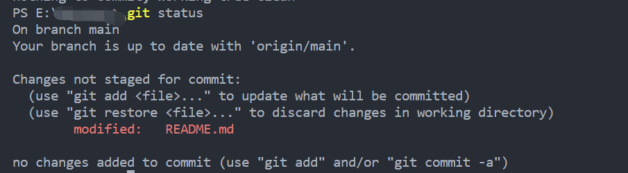
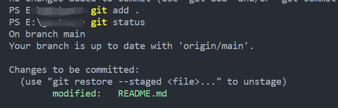
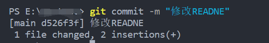
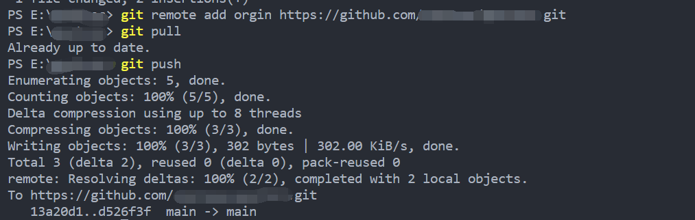

1. 使用`git init`进行空仓库的初始化，但是仓库是有东西的话就可以不用做这一步
2. 使用`git status`查看当前的状态，可以看到我对README.md进行了修改但是未提交

3. 使用`git add .`将所有添加或修改过的文件添加到暂存区
4. 使用`git status`再查看当前的状态，可以看到，文件就是被添加到了暂存区

5. 使用`git commit -m "提交信息"`提交暂存区的内容到本地仓库，“提交信息”可以修改为你对于修改的或者是新增的文件的一个描述或者做出的修改

6. 使用`git remote add origin 远程仓库地址`把文件添加到远程仓库
7. 如果是第一次提交，需要先将远程仓库的内容拉取下来，直接推送会报错，使用`git pull`
8. 使用`git push`把提交内容推送到远程仓库上

