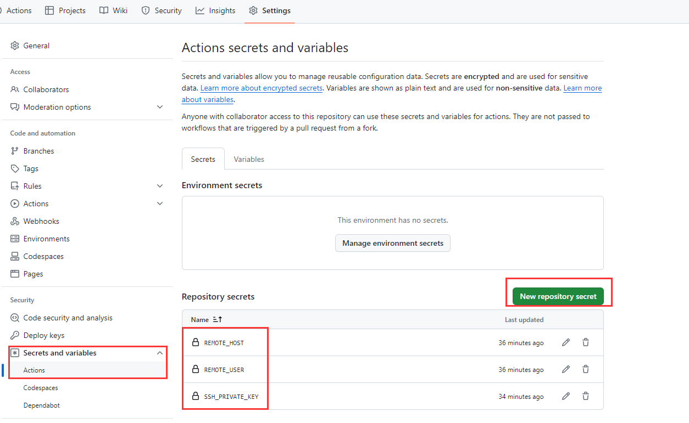

## 条件

- 拥有GitHub账号
- 已经构建好docusaurus
- 拥有自己的服务器

## 部署

### 服务器生成ssh密钥

运行 `ssh-keygen`命令即可生成公钥和私钥，只要把私钥添加到项目的仓库环境变量中即可

进入到你要用于ssh连接的用户的.ssh目录下，读取私钥

```bash
cat ~/.ssh/id_rsa
```

### 添加仓库环境变量

分别添加下面三个变量

| 变量名            | 说明                                              |
| ----------------- | ------------------------------------------------- |
| `REMOTE_HOST`     | 服务器IP或域名                                    |
| `REMOTE_USER`     | 用户ssh连接的用户名，要和上面提供私钥的用户相对应 |
| `SSH_PRIVATE_KEY` | 私钥                                              |



### 工作流代码

```bash
# 当前工作流的名称
name: docusaurus-deploy
on:
  push:
    branches:
      - main

jobs: # 构建的任务，一个工作流有多个构建任务，
  build-and-deploy:
    runs-on: ubuntu-latest # 在什么服务器上面执行这些任务，这里使用最新版本的ubuntu
  
    steps: # 构建任务的步骤，一个任务可分为多个步骤
      # 切换分支
      - name: Checkout
        uses: actions/checkout@v4
      # 步骤2 给当前服务器安装node
      - name: use node
        uses: actions/setup-node@v4
        with:
          node-version: 21
          cache: "npm"
      # 步骤3 下载项目依赖  
      - name: install
        run: npm install
      # 步骤4 打包node项目
      - name: build
        run: npm run build
      # 步骤5 部署项目到服务器
      - name: ssh deploy
        uses: easingthemes/ssh-deploy@v5.0.3
        with:
      # SSH 密钥对的私钥部分
          SSH_PRIVATE_KEY: ${{ secrets.SSH_PRIVATE_KEY }}
      # Remote host
          REMOTE_HOST: ${{ secrets.REMOTE_HOST }}
      # Remote user
          REMOTE_USER: ${{ secrets.REMOTE_USER }}
      # 源目录，相对于`$GITHUB_WORKSPACE`根的路径，我是部署docusaurus，，对应的目录就是构建好代码的存放目录：build
          SOURCE: "build"
      # 在 rsync 之前在主机上运行的脚本，这个目录因人而异
          SCRIPT_BEFORE: "mkdir -p ~/docusaurus/build"
      # 目标目录，这个目录和上面的对应即可，也是因人而异
          TARGET: "~/docusaurus/"
```

## 参考

- https://luvsia.com/code/github-actions-deploy.html
