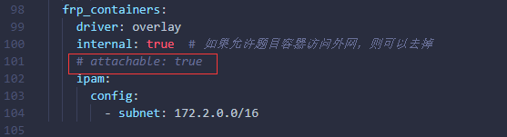
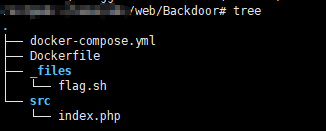
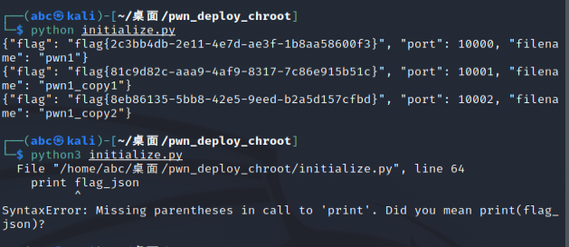

# 搭建

## 需求

> 1. 能满足互联网访问
> 2. web和pwn的环境是可以使用动态容器

## 准备

> 平台：开源项目[CTFd](https://github.com/CTFd/CTFd)
>
> 服务器：一个可以联网的，稳定运行的服务器（我们的平台用的是Ubuntu系统）
>
> 部署：docker部署
>
> CTFd动态容器插件：[CTFd-Whale](https://github.com/glzjin/CTFd-Whale)
>
> 一键部署多个pwn题的环境：[pwn_deploy_chroot](https://github.com/giantbranch/pwn_deploy_chroot)

## 教程

1. 懒人一键部署版：[**CTFd&ctfd-whale动态靶机搭建与维护**](https://www.yuque.com/hxfqg9/misc/ctfd)
2. 从头专研部署版：[**CTFd动态靶机搭建教程**](https://www.yuque.com/dat0u/ctfd/iogmqx)

## 个人搭建心得

1. 因为个人技术道行不足，加上个人开摆心态，我选择的是**懒人版本**
2. 这个版本git项目下来之后需要把`docker-compose.yml`里的一行代码注释或者删掉才能起得来（这个只针对懒人版）



# 对平台的优化

1. 服务绑定了域名，利用nginx进行代理80和443端口并绑定域名
2. 以及其他的优化，都写在了[CTFd平台个性化](https://a1pha.cn/archives/61429/)里

# 动态容器题目部署

## web

- 使用Github上开源的镜像做基础，分有分有很多类型，具体查看[ctfhub_base_image](https://github.com/ctfhub-team/ctfhub_base_image)

- web题目的模板结构



## pwn

- 在[ctfhub_base_image](https://github.com/ctfhub-team/ctfhub_base_image)这个仓库里面也有pwn的环境，还有一个[pwn_docker](https://github.com/TaQini/pwn_docker)，但是这两个我都没用上，而是用了[pwn_deploy_chroot](https://github.com/giantbranch/pwn_deploy_chroot)，这个环境可以一键部署多个题目，而且根据大佬们的博客教程上说，这个环境相对安全一点

- `pwn_deploy_chroot`里的`initialize.py`是用的python2的语法，所以运行时首先要看一下自己的python版本



- 如果系统中默认是python3的，又不想装python2，可以把`initialize.py`改成我的
- 源码：

```python
from config import *
import os
import uuid
import json

def getFileList():
    filelist = []
    for filename in os.listdir(PWN_BIN_PATH):
        filelist.append(filename)
    filelist.sort()
    return filelist

def isExistBeforeGetFlagAndPort(filename, contentBefore):
    filename_tmp = ""
    tmp_dict = ""
    ret = False
    for line in contentBefore:
        tmp_dict = json.loads(line)
        filename_tmp = tmp_dict["filename"]
        if filename == filename_tmp:
            ret = [tmp_dict["flag"], tmp_dict["port"]]
    return ret

def generateFlags(filelist):
    tmp_flag = ""
    contentBefore = []
    if not os.path.exists(FLAG_BAK_FILENAME):
        os.popen("touch " + FLAG_BAK_FILENAME)

    with open(FLAG_BAK_FILENAME, 'r') as f:
        while 1:
            line = f.readline()
            if not line:
                break
            contentBefore.append(line)
    # bin's num != flags.txt's linenum, empty the flags.txt
    if len(filelist) != len(contentBefore):
        os.popen("echo '' > " + FLAG_BAK_FILENAME)
        contentBefore = []
    port = PORT_LISTEN_START_FROM + len(contentBefore)
    flags = []
    with open(FLAG_BAK_FILENAME, 'w') as f:
        for filename in filelist:
            flag_dict = {}
            ret = isExistBeforeGetFlagAndPort(filename, contentBefore)
            if ret == False:
                tmp_flag = "flag{" + str(uuid.uuid4()) + "}"
                flag_dict["port"] = port
                port = port + 1
            else:
                tmp_flag = ret[0]
                flag_dict["port"] = ret[1]

            flag_dict["filename"] = filename
            flag_dict["flag"] = tmp_flag
            flag_json = json.dumps(flag_dict)
            print (flag_json)
            f.write(flag_json + "\n")
            flags.append(tmp_flag)
    return flags

def generateXinetd(filelist):
    contentBefore = []
    with open(FLAG_BAK_FILENAME, 'r') as f:
        while 1:
            line = f.readline()
            if not line:
                break
            contentBefore.append(line)
    conf = ""
    uid = 1000
    for filename in filelist:
        port = isExistBeforeGetFlagAndPort(filename, contentBefore)[1]
        conf += XINETD % (port, str(uid) + ":" + str(uid), filename, filename)
        uid = uid + 1
    with open(XINETD_CONF_FILENAME, 'w') as f:
            f.write(conf)

def generateDockerfile(filelist, flags):
    conf = ""
    # useradd and put flag
    runcmd = "RUN "
    
    for filename in filelist:
        runcmd += "useradd -m " + filename + " && "
   
    for x in range(0, len(filelist)):
        if x == len(filelist) - 1:
            runcmd += "echo '" + flags[x] + "' > /home/" + filelist[x] + "/flag.txt" 
        else:
            runcmd += "echo '" + flags[x] + "' > /home/" + filelist[x] + "/flag.txt" + " && "
    # print runcmd 

    # copy bin
    copybin = ""
    for filename in filelist:
        copybin += "COPY " + PWN_BIN_PATH + "/" + filename  + " /home/" + filename + "/" + filename + "\n"
        if REPLACE_BINSH:
            copybin += "COPY ./catflag" + " /home/" + filename + "/bin/sh\n"
        else:
            copybin += "COPY ./catflag" + " /home/" + filename + "/bin/sh\n"

    # print copybin

    # chown & chmod
    chown_chmod = "RUN "
    for x in range(0, len(filelist)):
        chown_chmod += "chown -R root:" + filelist[x] + " /home/" + filelist[x] + " && "
        chown_chmod += "chmod -R 750 /home/" + filelist[x] + " && "
        if x == len(filelist) - 1:
            chown_chmod += "chmod 740 /home/" + filelist[x] + "/flag.txt"
        else:
            chown_chmod += "chmod 740 /home/" + filelist[x] + "/flag.txt" + " && "
    # print chown_chmod

    # copy lib,/bin 
    # dev = '''mkdir /home/%s/dev && mknod /home/%s/dev/null c 1 3 && mknod /home/%s/dev/zero c 1 5 && mknod /home/%s/dev/random c 1 8 && mknod /home/%s/dev/urandom c 1 9 && chmod 666 /home/%s/dev/* && '''
    dev = '''mkdir /home/%s/dev && mknod /home/%s/dev/null c 1 3 && mknod /home/%s/dev/zero c 1 5 && mknod /home/%s/dev/random c 1 8 && mknod /home/%s/dev/urandom c 1 9 && chmod 666 /home/%s/dev/* '''
    if not REPLACE_BINSH:
        # ness_bin = '''mkdir /home/%s/bin && cp /bin/sh /home/%s/bin && cp /bin/ls /home/%s/bin && cp /bin/cat /home/%s/bin'''
        ness_bin = '''&& cp /bin/sh /home/%s/bin && cp /bin/ls /home/%s/bin && cp /bin/cat /home/%s/bin'''
    copy_lib_bin_dev = "RUN "
    for x in range(0, len(filelist)):
        copy_lib_bin_dev += "cp -R /lib* /home/" + filelist[x]  + " && "
        copy_lib_bin_dev += "cp -R /usr/lib* /home/" + filelist[x]  + " && "
        copy_lib_bin_dev += dev % (filelist[x], filelist[x], filelist[x], filelist[x], filelist[x], filelist[x])
        if x == len(filelist) - 1:
            if not REPLACE_BINSH:
                copy_lib_bin_dev += ness_bin % (filelist[x], filelist[x], filelist[x])
            pass                
        else: 
            if not REPLACE_BINSH:   
                copy_lib_bin_dev += ness_bin % (filelist[x], filelist[x], filelist[x]) + " && "
            else:
                copy_lib_bin_dev += " && "

    # print copy_lib_bin_dev

    conf = DOCKERFILE % (runcmd, copybin, chown_chmod, copy_lib_bin_dev)

    with open("Dockerfile", 'w') as f:
        f.write(conf)

def generateDockerCompose(length):
    conf = ""
    ports = ""
    port = PORT_LISTEN_START_FROM
    for x in range(0,length):
        ports += "- " + str(port) + ":" + str(port) + "\n    "
        port = port + 1

    conf = DOCKERCOMPOSE % ports
    # print conf
    with open("docker-compose.yml", 'w') as f:
        f.write(conf)

# def generateBinPort(filelist):
#     port = PORT_LISTEN_START_FROM
#     tmp = ""
#     for filename in filelist:
#         tmp += filename  + "'s port: " + str(port) + "\n"
#         port = port + 1
#     print tmp
#     with open(PORT_INFO_FILENAME, 'w') as f:
#         f.write(tmp)
    
filelist = getFileList()
flags = generateFlags(filelist)
# generateBinPort(filelist)
generateXinetd(filelist)
generateDockerfile(filelist, flags)
generateDockerCompose(len(filelist))
```

# 运维历程

<p style="text-indent: 2em;">平台搭好之后就是上题，能正常的访问和答题，界面也都只是初始的样子，在我返校前这段时间就是在琢磨怎么把web和pwn的环境搭起来，也学习了一下Dockerfile和docker-compose.yml的编写。</p>
<p style="text-indent: 2em;">回校之后就是做平台页面的个性化，增加了四个子页面，最初是全部展示在导航栏上的，后面在群里问了师傅们，去看了一下BUU平台的源码，然后照葫芦画瓢的弄出了收缩版的，使得导航栏没有这么的拥挤。还有也是看到BUU平台上的web题目的链接可以直接点击跳转，也想在招新平台上实现，在和群里的师傅们交流之后也是能实现了，但是美中不足的是，pwn题目是不需要这个功能的，但是修改之后pwn的链接也和web一样可以直接点击，这还有待优化。</p>
<p style="text-indent: 2em;">9月份开学之后，平台上也越来越多学弟学妹去注册做题了，然后有一天就不知道什么原因，web的题目全体罢工了，全都连接不上了，重装docker，把所有环境全部重来安装也不行，最后重装系统也是不行，最后换到了我的服务器上就好了，我也不知道什么原因（之前是部署在学长的服务器上），然后前几天打完美团的CTF之后有一道题，学长觉得很好就改了一下放到了平台上，搭起来之后，我一直就是打不通，但是我在自己本地docker起的时候是能通的，后面排查出是因为CTFd平台默认是所有的容器都不出网，导致了题目无法正常的弹shell，然后我就开始在本地的服务器上去部署实验，最后是能出网了，我就开始按着在本地怎么操作的，到云服务器上操作一遍，但是就是死活不成功，还有就是要么成了之后平台点进挑战的界面就一直转圈圈，无法加载出来。我就又重新搭了一遍，这次就把web和pwn的题目全下了，后面就想着既然本地的能跑，那就把本地服务映射出去，最初是看的是frp，但是看着配置有点麻烦，然后又恰好发现了一个新的神器nps，简单的了解了一下之后就开始上手，现在已经能稳定的运行了，但是最近的校园网网络环境非常的不好，服务器偶尔会掉线，导致了服务不能正常的访问。</p>

# 题外话

> 最近在csdn上发现了一个大佬做的毕设，是ctf平台的，看了简介之后有点小心动，他的项目也是开源了，在GitHub上可以看得到，所以找个时间，我把平台搭起来试一下看如何。


